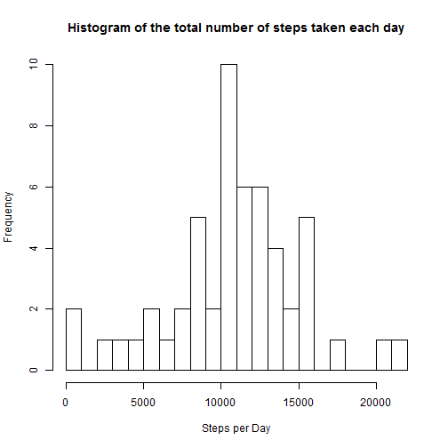
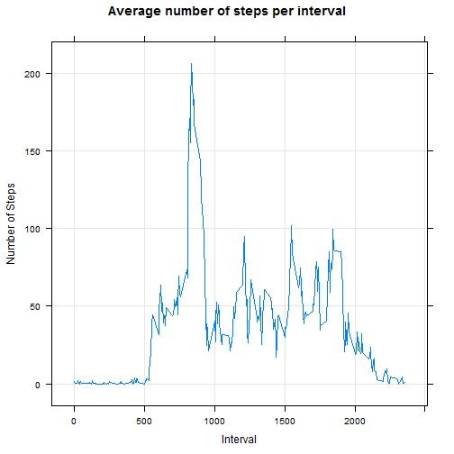
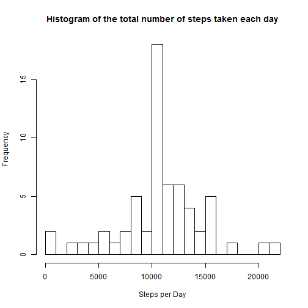
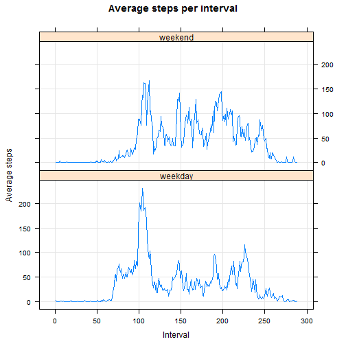

## Introduction
It is now possible to collect a large amount of data about personal movement using activity monitoring devices such as a Fitbit, Nike Fuelband, or Jawbone Up. These type of devices are part of the "quantified self" movement -- a group of enthusiasts who take measurements about themselves regularly to improve their health, to find patterns in their behavior, or because they are tech geeks. But these data remain under-utilized both because the raw data are hard to obtain and there is a lack of statistical methods and software for processing and interpreting the data.

This assignment makes use of data from a personal activity monitoring device. This device collects data at 5 minute intervals through out the day. The data consists of two months of data from an anonymous individual collected during the months of October and November, 2012 and include the number of steps taken in 5 minute intervals each day.

## Data

The data for this assignment can be downloaded from the course web site:

* Dataset: https://d396qusza40orc.cloudfront.net/repdata%2Fdata%2Factivity.zip

The variables included in this dataset are:

* steps: Number of steps taking in a 5-minute interval (missing values are coded as NA)

* date: The date on which the measurement was taken in YYYY-MM-DD format

* interval: Identifier for the 5-minute interval in which measurement was taken

The dataset is stored in a comma-separated-value (CSV) file and there are a total of 17,568 observations in this dataset.

## Assignment
### Loading and preprocessing the data

* Load the data
* Process/transform the data (if necessary) into a format suitable for your analysis

```r
# I set the working directory to the location where the data was unzipped and loaded the neccessary packages to perform the analysis.
library(lubridate)
```

```
## Warning: package 'lubridate' was built under R version 3.1.3
```

```r
library(dplyr)
```

```
## Warning: package 'dplyr' was built under R version 3.1.2
```

```r
library(lattice)
```

```r
activity <- read.csv(unz("activity.zip", "activity.csv"), header = TRUE)
head(activity)
```

```
##   steps       date interval
## 1    NA 2012-10-01        0
## 2    NA 2012-10-01        5
## 3    NA 2012-10-01       10
## 4    NA 2012-10-01       15
## 5    NA 2012-10-01       20
## 6    NA 2012-10-01       25
```

```r
# transform data into a format compatible with the dply package.
act <- tbl_df(activity) 
```


### What is mean total number of steps taken per day?

For this part of the assignment, you can ignore the missing values in the dataset.

* Make a histogram of the total number of steps taken each day.

```r
# I filtered out every row with NAs.
act2 <- filter(act, !is.na(steps)) 
# First I group the data by date, so every operation I make with 
# different functions of the dplyr package are applied to each date. 
by_date <- group_by(act2, date = date)
# I use summarize function to sum the total number of steps
# per day                      
step_per_day <- summarize(by_date, steps_day = sum(steps))
# histogram for the total number of steps per day
hist(step_per_day$steps_day, breaks = 20, main = 'Histogram of the total number of steps taken each day', xlab = 'Steps per Day')
```

 

* Calculate and report the mean and median total number of steps taken per day


```r
mean(step_per_day$steps_day)
```

```
## [1] 10766.19
```

```r
median(step_per_day$steps_day)
```

```
## [1] 10765
```


### What is the average daily activity pattern?

* Make a time series plot (i.e. type = "l") of the 5-minute interval (x-axis) and the average number of steps taken, averaged across all days (y-axis)


```r
# First I group the data by interval for then calculating the average number of steps per interval acrross every day.
by_interval <- group_by(act2, interval = interval)
m_steps_int <- summarize(by_interval, mean_steps_int = mean(steps))
xyplot(m_steps_int$mean_steps_int~m_steps_int$interval, type = "l", main = "Average number of steps per interval", xlab = "Interval", ylab = "Number of Steps", grid = TRUE)
```

 


* Which 5-minute interval, on average across all the days in the dataset, contains the maximum number of steps?


```r
max(m_steps_int[,2])
```

```
## [1] 206.1698
```

```r
filter(m_steps_int, mean_steps_int > 206)
```

```
## Source: local data frame [1 x 2]
## 
##   interval mean_steps_int
## 1      835       206.1698
```

```r
which(m_steps_int$interval == 835)
```

```
## [1] 104
```

The 104th interval correspondng to 8:35 am is the interval with the larger average of steps across all days: 206.1698 steps on average.


### Imputing missing values 

Note that there are a number of days/intervals where there are missing values (coded as NA). The presence of missing days may introduce bias into some calculations or summaries of the data.

* Calculate and report the total number of missing values in the dataset (i.e. the total number of rows with NAs)


```r
(mv <- sum(is.na(act$steps))) 
```

```
## [1] 2304
```
2304 is the total number of intervals with missing values.

* Devise a strategy for filling in all of the missing values in the dataset. The strategy does not need to be sophisticated. For example, you could use the mean/median for that day, or the mean for that 5-minute interval, etc.

I filled the missing values with the mean for that 5-minute interval.

* Create a new dataset that is equal to the original dataset but with the missing data filled in.

```r
# I extracted the mean steps per interval 
# from the m-steps_int  dataframe.
ms_int <- m_steps_int[[2]] 
 # cbinded it to the dataframe which does not exclude missing values (act)
act3 <- cbind(act,ms_int)
# where steps where missing I replaced NA with the average number of steps taken in that interval.
act3$steps[is.na(act3$steps)] <- act3$ms_int 
```

```
## Warning in act3$steps[is.na(act3$steps)] <- act3$ms_int: number of items
## to replace is not a multiple of replacement length
```

* Make a histogram of the total number of steps taken each day and Calculate and report the mean and median total number of steps taken per day. Do these values differ from the estimates from the first part of the assignment? What is the impact of imputing missing data on the estimates of the total daily number of steps?


```r
by_date2 <- group_by(act3, date = date)
step_per_day2 <- summarize(by_date2, steps_day = sum(steps))
hist(step_per_day2$steps_day, breaks = 20, main = 'Histogram of the total number of steps taken each day', xlab = 'Steps per Day')
```

 

```r
mean(step_per_day2$steps_day)
```

```
## [1] 10766.19
```

```r
median(step_per_day2$steps_day)
```

```
## [1] 10766.19
```

There are a few difference between this data, with imputed missing values, and the previous data that omitted them. First, now we have 61 days instead of 53 because there are no longer NAs. To understand how the imputed missing values may bias the dataset is important to know how this missing values are distributed within different days.

```r
by_date3 <- group_by(act, date = date)
na_per_day3 <- summarize(by_date3, na_day = sum(is.na(steps)))
table(na_per_day3$na_day)
```

```
## 
##   0 288 
##  53   8
```
We can see there are days for which there is missing data for every interval (8 days in total with 288 NAs each). All of other days  have complete data. Therefore, those 8 days have the same statistics (same mean, median, etc.)

Because of this our new histogram is no different from the first one except for the fact that we have 8 more days with the same mean, therefore the frequency of the mean is higher than before. The rest of steps per day remain the same. Therefore, for this last histogram the mean remains the same while the median turns out to be the same as the mean (1.19 steps higher than the median of the first histogram). Imputing missing values with the mean of the non missing values of that variable does not add additional information, that is why both datasets have the same mean.

### Are there differences in activity patterns between weekdays and weekends?

For this part the weekdays() function may be of some help here. Use the dataset with the filled-in missing values for this part.

* Create a new factor variable in the dataset with two levels - "weekday" and "weekend" indicating whether a given date is a weekday or weekend day.


```r
act3$date <- as.Date(act3$date)
# label TRUE so the  
# name of the day is shown instead of a number representing it
day_of_week <- wday(act3$date, label=TRUE) 
day_of_week <- cbind(act3, day_of_week)
# Levels: Sun < Mon < Tues < Wed < Thurs < Fri < Sat
day_of_week <- mutate(day_of_week, weekend = day_of_week < "Mon" | day_of_week > "Fri") 
day_of_week$weekend <- factor(day_of_week$weekend, labels = c("weekday", "weekend"))
day_of_week <- select(day_of_week, date, interval, steps, weekend)
```

* Make a panel plot containing a time series plot (i.e. type = "l") of the 5-minute interval (x-axis) and the average number of steps taken, averaged across all weekday days or weekend days (y-axis). The plot should look something like the following, which was created using simulated data:

#### Smothing the line in the time series plot.

Instead of using the original format of the interval variable I used the number of the interval as the interval value (first interval = 1, 2nd interval = 2 and so on until 288.)


```r
wd.wk <- group_by(day_of_week, weekend, interval)
new_int  <- mutate(wd.wk, ones = 1)
new_int  <- group_by(new_int, date)
new_int <- mutate(new_int, nth = cumsum(ones))
new_int <- select(new_int, nth, steps, weekend)
```

Then I perform the neccessary steps for creating the plot with this new variable.


```r
wd.wk2 <- group_by(new_int, weekend, nth)
avg.steps2 <- summarize(wd.wk2, mean_steps= mean(steps) )
xyplot(mean_steps~nth | weekend , data = avg.steps2,
          main="Average steps per interval",
   xlab="Interval", ylab = "Average steps", type = "l", layout=c(1, 2), grid = TRUE)
```

 

As you can see, the lines connecting the dot looks a little bit smoother. We can also see that during the weekend activity is spread more evenly than during the week. 
